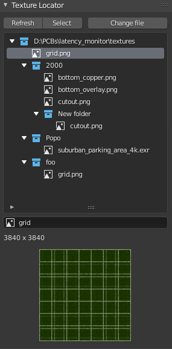

# Texture Locator

### Summary

Show a view of all files used by image nodes in the current material and allow the user to change the sources.

Under the list (tree) view of files, the currently selected file is previewed and images which use it can be renamed.

### Screenshot



### Buttons

Above the files there are some buttons, this is what they do:

|Button|Function|
|-|-|
|Refresh|Scans the node tree for all source images|
|Select|Selects all nodes which use an image or any image in a folder|
|Change File|Change the source for images which use the selected file|
|Change Folder|Change all sources in a folder (recursively), any missing images will be left unchanged|


### Notes / Issues / Limitations

I haven't managed to get `bpy.msgbus` to trigger a callback when the set of nodes in the active material changes, so you have to click 'Refresh' after adding or removing any Image nodes. If anyone knows how to make this work I'd be happy to hear about it.

The UIList view of files/folders is jerry-rigged to look like a tree view. It sort of works but is kind of janky. I couldn't find a proper tree view exposed in the Python API anywhere.

The tooltips for the items in the UIList are all kinds of wrong. I haven't figured out how to make them useful.

### bl_info

```
bl_info = {
    "name": "Texture Locator",
    "description": "For managing Image node sources",
    "blender": (2, 80, 0),
    "category": "Material",
    "location": "Material > Tool",
    "author": "Charlie Skilbeck",
    "version": (0, 0, 1),
    "support": "TESTING",
    "doc_url": "http://skilbeck.com",
    "wiki_url": "",
    "tracker_url": ""
}
```